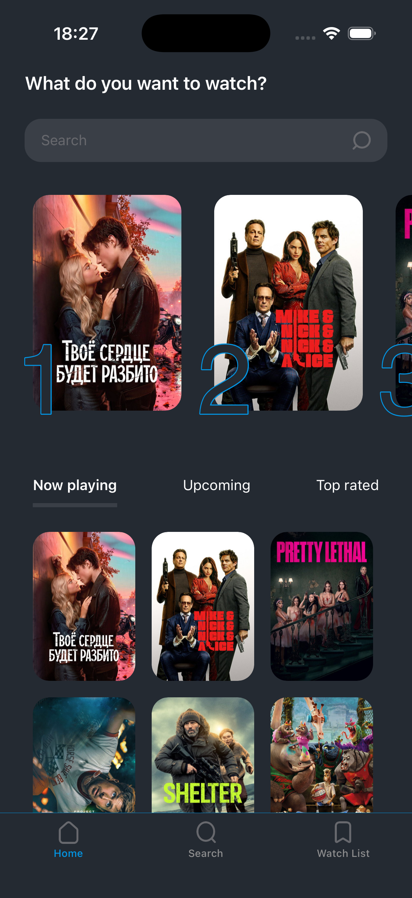
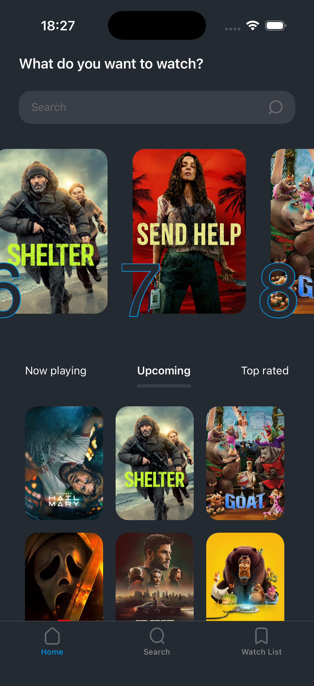
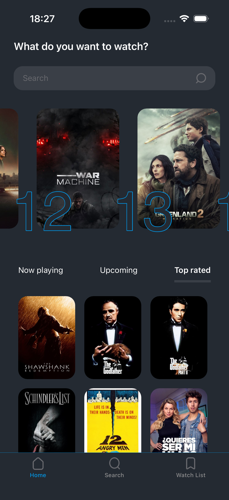
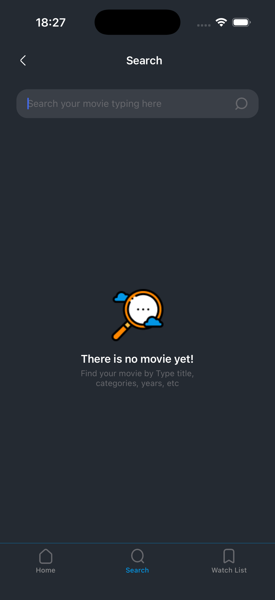
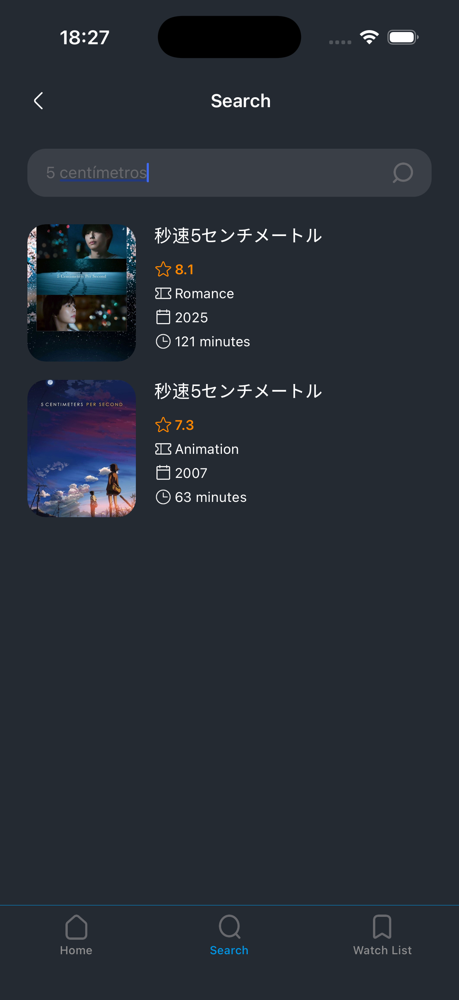
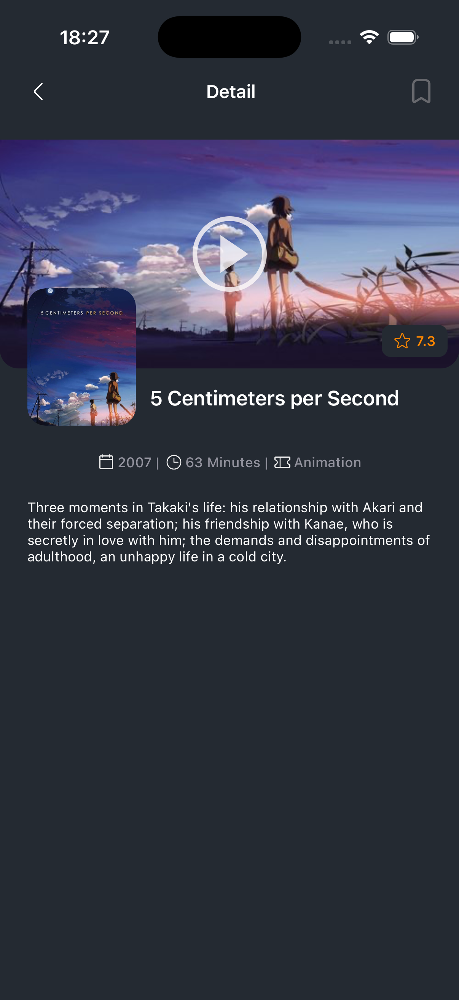
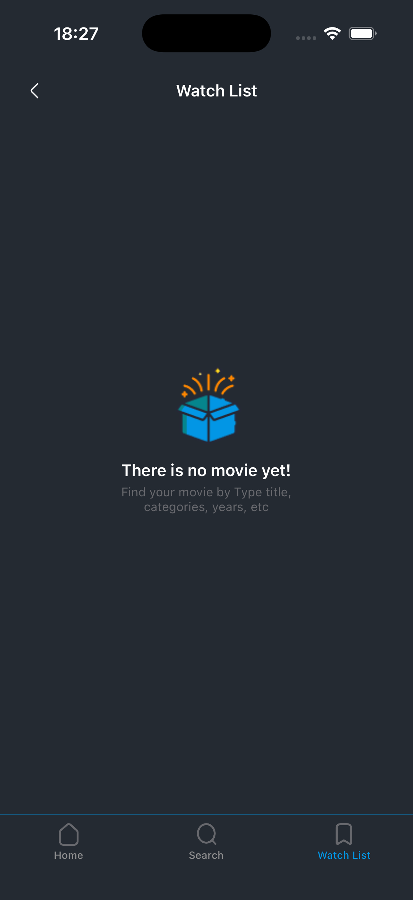
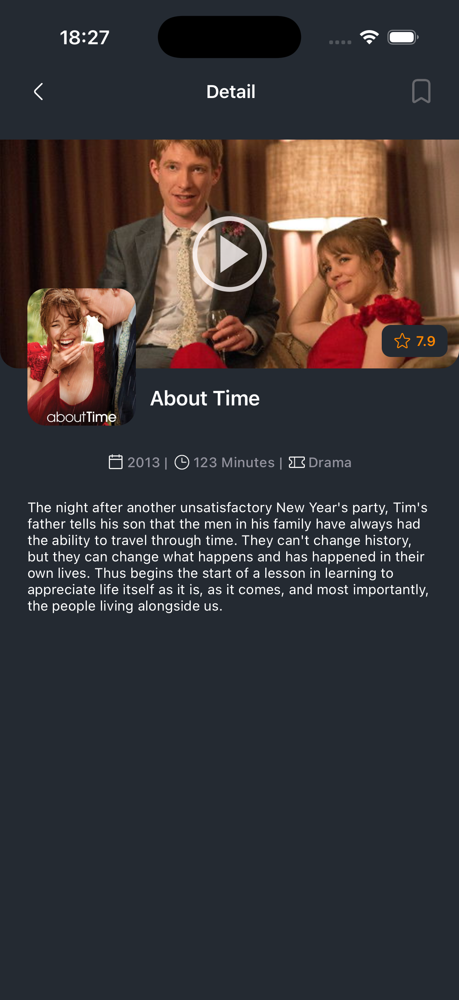
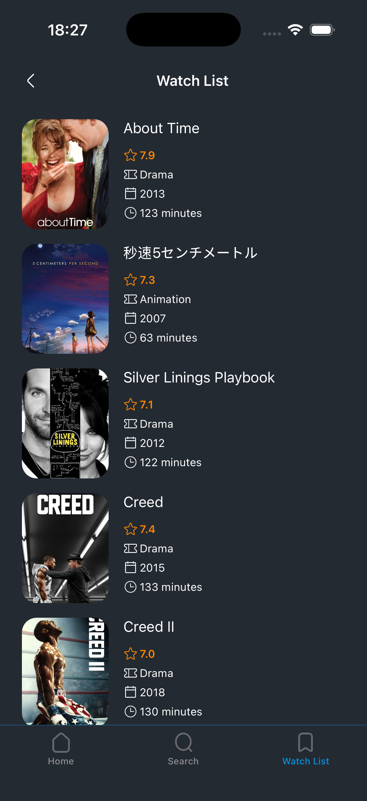
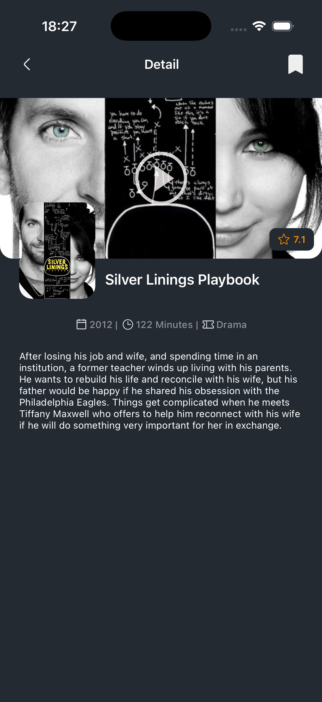

<div align="center">
  
</div>

# Movie App

A showcase project created to help you search, get details, and save a watch list of your favorite movies.

---

<div align="left">
  
  
  
  
</div>
<div align="left">
  
  
  
  
</div>
<div align="left">
  
  
  
  
</div>

---
### Questions:
- What does the single responsibility principle consist of? What's its purpose?

> R: It's part of the SOLID principles, it indicates that every function, module, etc, must have just a well defined responsability. I applyed this principle in this project with the Dependency Injection, by create Statefull and Stateless components with separated responsabilities.

- What characteristics, in your opinion, does “good” code or clean code have?

> R: To write small and reusable components, create pure functions, use memoization for performance (useMemo, useCallback, etc), avoid prop drilling, use typescript, eslint and prettier, and define meaningfull variable names.

- Detail how you would do everything that you have not completed.
> R: I would implement a global state managment using Redux and create a cache system within this library. Expand my test coverage targeting 70% of coverage by write tests with testing library, follow more of the DRY (Dont Repeat Yourself) and reuse better the code I wrote for now. I would split the code in smaller and reusable components and implement a design sistem using Styled Components with Context for the theme for exemple, also treat better the exceptions in my request with try catch blocks and sending error trackings to a platform like Firebase or Sentry. Also fix small details that I did't have time to fix now, such as spacements, app icon and name, add more animations, loadings, skeletons and etc.
---

## Setup


1. Install dependencies:
```bash
   npm install
```

2. Start metro bundler
```bash
   npm run start
```

3. Open the app in a android emulator
```bash
   npm run android
```

3. Or, open the app with a ios simulator
```bash
   npm run ios
```
> * the .env file is present in the project repo just to facilitate the instalation, it would be remove later.

---

## Tools

- React Native
- Typescript
- Axios
- React Query
- React Navigation
- React Native Bootsplash
- React Native MMKV
- React Native SVG
- React Native Stroke Text
- React Native Safe Area Context

---

## Architecture

The project was built with a modular architecture, where each folder inside screens/ represents an independent module of the application.
Module pattern
Each module follows the same writing pattern, separating responsibilities between two types of components:

Stateful Components (screens/) — manage business logic and state
Stateless Components (components/) — only render data received via props

This separation makes components easy to test in isolation, since Stateless Components receive their data through dependency injection.

---

### Folder Structure

This structure makes the project ready to scale, whether for adding new features or onboarding new team members, without compromising the organization of the codebase.

```
├── assets/
│   ├── bootsplash/
│   ├── fonts/
│   ├── icons/
│   ├── images/
│   └── screenshots/
├── src/
│   ├── api/
│   ├── components/
│   │   ├── header/
│   │   ├── input/
│   │   └── tabs/
│   ├── constants/
│   ├── hooks/
│   ├── models/
│   ├── modules/
│   │   ├── detail/
│   │   ├── home/
│   │   │   ├── components/
│   │   │   └── screens/
│   │   ├── search/
│   │   │   ├── components/
│   │   │   └── screens/
│   │   └── watch-list/
│   │       ├── components/
│   │       │   └── __tests__/
│   │       └── screens/
│   ├── navigation/
│   ├── services/
│   ├── store/
│   └── utils/
```

